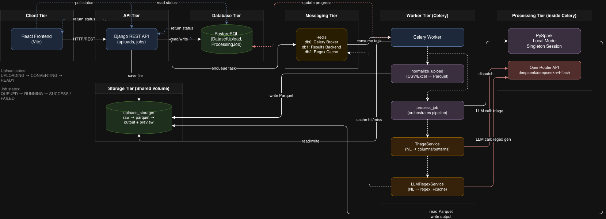
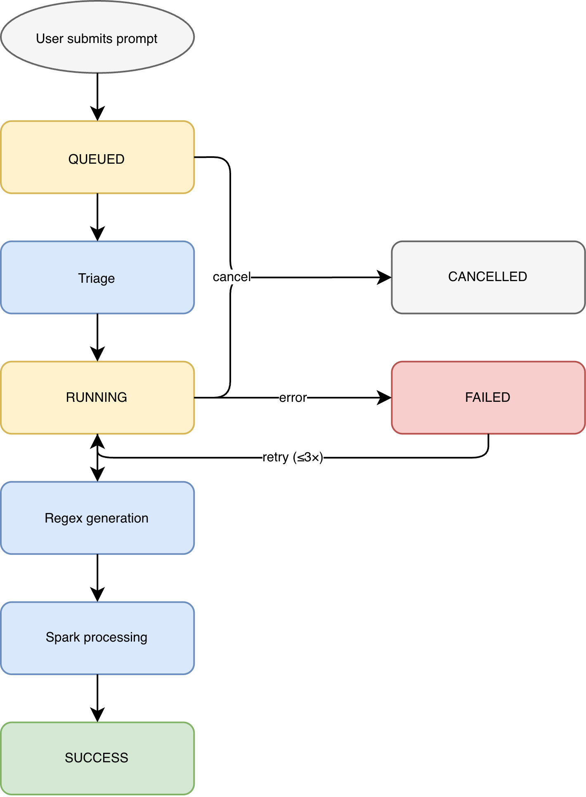

# Distributed NL-to-Regex Data Processing Platform

Upload large CSV/Excel datasets, describe patterns in natural language, and replace them asynchronously at scale. Built with Django, React, Celery, Redis, and PySpark.

## Architecture



The system separates concerns across four layers:

1. **Web layer** (Django): Handles HTTP requests, returns immediately with job IDs. Never processes data inline.
2. **Task queue** (Celery + Redis): All file parsing, regex generation, and replacement runs as background tasks. Redis serves as broker, result backend, and LLM response cache.
3. **Processing engine** (PySpark): Reads/writes Parquet, applies regex transformations as Spark projections across partitions. Scales horizontally by adding Celery workers.
4. **Storage** (PostgreSQL + filesystem): Django models in PostgreSQL, raw and processed data on shared filesystem as Parquet.

### Key design decisions

- __Two LLM calls__: A triage call parses the natural language prompt into structured `(column, nl_pattern, replacement)` tuples, then a regex generation call produces each pattern. See [ADR 0003](docs/adr/0003-two-llm-calls-triage-and-regex-generation.md).
- **Parquet as canonical format**: All uploads are normalized to Parquet after upload. PySpark never sees CSV/Excel directly. See [ADR 0002](docs/adr/0002-parquet-as-canonical-internal-format.md).
- **PySpark local mode with singleton session**: One JVM per Celery worker, reused across tasks. Swap the factory for a remote cluster if needed. See [ADR 0004](docs/adr/0004-pyspark-local-mode-with-singleton-session.md).
- **Regex safety**: Generated patterns are validated (compilation check) and guarded against catastrophic backtracking (signal.alarm timeout). Cached in Redis keyed by SHA-256 of the prompt.

### Partitioning strategy

PySpark runs in local mode inside the Celery worker. Default partitioning (200 shuffle partitions, file-splits for Parquet reads) is used. Rationale:

- The bottleneck for single-node deployments is I/O and LLM latency, not partition count. Default `spark.sql.shuffle.partitions=200` is sufficient for datasets up to millions of rows.
- For a multi-node deployment, increase `SPARK_MASTER` from `local[*]` to a cluster URL and tune `spark.sql.shuffle.partitions` to `2x-3x` the number of executor cores. No code changes required; the session factory reads from env.
- Preview files (first 100 rows) are written separately so the frontend can paginate without reading the full output.

---

## Quick Start

### Prerequisites

- Docker and Docker Compose
- Node.js 18+
- An LLM API key (OpenRouter or Gemini)

### 1. Configure environment

```bash
cp .env.example .env
# Edit .env: set OPENROUTER_API_KEY and/or GEMINI_API_KEY
```

### 2. Start backend services

```bash
docker-compose up --build -d
```

This brings up Redis, PostgreSQL, the Django web server, and the Celery worker (with PySpark).

The API is available at `http://localhost:8000`.

### 3. Start the frontend

```bash
cd frontend
npm install
npm run dev
```

The UI is available at `http://localhost:3000`.

---

## API Endpoints

| Endpoint | Method | Description |
| :--- | :--- | :--- |
| `/api/upload/` | `POST` | Upload CSV/Excel, returns `dataset_id` after normalization |
| `/api/jobs/start/` | `POST` | Start a replacement job, returns `job_id` immediately |
| `/api/jobs/<id>/status/` | `GET` | Poll job status (`QUEUED`/`RUNNING`/`SUCCESS`/`FAILED`) and progress |
| `/api/jobs/<id>/results/` | `GET` | Paginated processed output (`?page=N&page_size=M`) |
| `/api/jobs/<id>/cancel/` | `POST` | Cancel a running job |

### Request examples

**Upload a dataset:**

**Start a replacement job:**

**Poll status:**

```bash
curl http://localhost:8000/api/jobs/2/status/
# {"status": "RUNNING", "progress": 65}
```

---

## Job Lifecycle



---

## Large File Handling

The pipeline is designed for datasets with millions of rows:

- **Upload**: Files stream to disk, not into memory. Celery normalizes to Parquet asynchronously.
- **Processing**: PySpark operates on partitions, not row-by-row pandas iteration. A single projection expression applies all regex replacements.
- **Results**: Output is written as Parquet part files. The API paginates via pandas reads of the preview file (first 100 rows). Full output stays on disk for download.

To test with a large dataset:

```bash
# Generate a 1M-row CSV
python backend/manage.py generate_test_csv --rows 1000000 --output test_data.csv
# Upload and process through the UI or API
```

---

## Tech Stack

| Layer | Technology |
| :--- | :--- |
| Backend framework | Django 5.x |
| Task queue | Celery 5.x |
| Message broker / cache / result backend | Redis 7.2 |
| Database | PostgreSQL 15 |
| Processing engine | PySpark 3.5.1 |
| LLM integration | OpenRouter API (deepseek/deepseek-v4-flash) |
| Frontend | React 18 + Vite |
| Containerization | Docker Compose |

---

## Project Structure

```rb
backend/
  core/              # Django project settings, Celery config, URLs
  api/               # REST views, serializers, URL routing
  datasets/          # DatasetUpload model, upload logic
  jobs/              # ProcessingJob model, status transitions
  processing/        # LLMRegexService, TriageService, SparkProcessingService
  tasks/             # Celery tasks: normalize_upload, process_job
frontend/
  src/               # React components, API client, pages
docs/
  adr/               # Architecture Decision Records (0001-0005)
  diagrams/          # Architecture diagram (drawio, png, svg)
```

---

## Architecture Decision Records

| ADR | Title |
| :--- | :--- |
| [0001](docs/adr/0001-postgresql-for-models-filesystem-for-pyspark-uploads.md) | PostgreSQL for models, filesystem for PySpark uploads |
| [0002](docs/adr/0002-parquet-as-canonical-internal-format.md) | Parquet as canonical internal format |
| [0003](docs/adr/0003-two-llm-calls-triage-and-regex-generation.md) | Two LLM calls: triage and regex generation |
| [0004](docs/adr/0004-pyspark-local-mode-with-singleton-session.md) | PySpark local mode with singleton session |
| [0005](docs/adr/0005-retry-cancellation-and-api-design.md) | Retry, cancellation, and API design |

---

## Trade-offs and Notes

- __Local-mode Spark__: Chosen for simplicity in a single-node Docker Compose setup. To scale out, point `SPARK_MASTER` at a cluster and increase `spark.sql.shuffle.partitions`. No code changes needed.
- **Two LLM calls**: Adds latency but produces more accurate column/pattern extraction. The triage step validates columns against the dataset schema, preventing hallucinated column names.
- **Redis for caching**: LLM regex responses are cached by SHA-256 of the prompt. Identical prompts skip the LLM call entirely. TTL is configurable.
- **Celery retry with whole-task reset**: On transient failure, the entire job resets (progress, output paths) and retries from the beginning. This avoids partial-state bugs at the cost of re-doing work. See ADR 0005.
- **Frontend polling**: The UI polls `/status/` on a timer rather than using WebSockets, keeping the stack simple for a single-user demo.

---

## Deployment

> **Note**: Public deployment URL and demo video will be added here.

The Docker Compose setup is production-ready for single-node deployments. For multi-node, separate the Celery worker into its own service with `SPARK_MASTER` pointing to a Spark cluster.