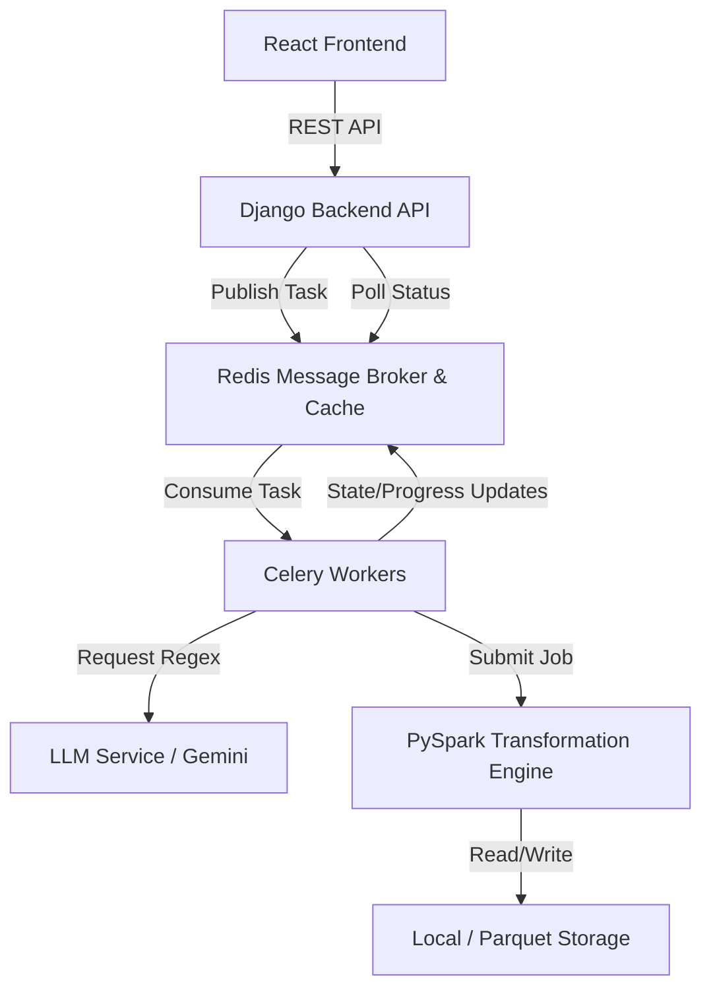

# Distributed NL-to-Regex Data Processing Platform Implementation Plan

> **For agentic workers:** REQUIRED SUB-SKILL: Use superpowers:subagent-driven-development (recommended) or superpowers:executing-plans to implement this plan task-by-task. Steps use checkbox (`- [ ]`) syntax for tracking.

**Goal:** Build a web application using Django, React, Celery, Redis, and PySpark that allows users to upload large CSV/Excel files, identify patterns via natural-language input converted to regex using an LLM, and asynchronously replace matched patterns across millions of rows without blocking the web request cycle.

**Architecture:** A decoupled, asynchronous architecture featuring a Django REST API backend for job orchestration, Redis as a Celery message broker, result backend, and caching layer, a Celery task queue for managing non-blocking execution with progress reporting, a PySpark distributed transformation engine for horizontal scaling of regex pattern replacement over large datasets, and a responsive React frontend displaying live job progress and paginated data tables.

**Tech Stack:** Django, Django REST Framework, Celery, Redis, PySpark, React, Vite, Axios, Tailwind CSS, Docker, Docker Compose, PyTest, Jest.

## Global Constraints

- Asynchronous processing required: The web process must never perform heavy processing inline; all file parsing, regex generation, and replacement work must run as background tasks via Celery.
- Large dataset handling: Large files must not be loaded entirely into the web process; results must be paged/streamed and never return millions of rows to the browser at once.
- Redis caching: LLM-generated regex patterns must be cached in Redis keyed by the natural-language prompt so identical requests are not re-sent to the LLM.
- Distributed transformation: The core pattern-matching and replacement engine must be implemented in PySpark to scale horizontally across partitions.
- LLM validation: Generated regex patterns must be validated and sanitised to guard against catastrophic backtracking and invalid patterns before execution.
- End-to-end containerisation: A docker-compose setup must bring up the web app, Celery workers, Redis, and Spark runtime with a single command.

---

### Task 1: Project Scaffolding & Docker Configuration

**Files:**
- Create: `docker-compose.yml`
- Create: `backend/Dockerfile`
- Create: `backend/requirements.txt`
- Create: `backend/pytest.ini`
- Create: `backend/tests/test_scaffolding.py`

**Interfaces:**
- Consumes: None
- Produces: Base configuration and container definitions for the complete runtime stack (`web`, `celery`, `redis`, `spark`).

- [ ] **Step 1: Write the failing test**

```python
# backend/tests/test_scaffolding.py
import os

def test_requirements_exists():
    assert os.path.exists("backend/requirements.txt") or os.path.exists("requirements.txt")

def test_docker_compose_exists():
    assert os.path.exists("docker-compose.yml") or os.path.exists("../docker-compose.yml")
```

- [ ] **Step 2: Run test to verify it fails**

Run: `pytest backend/tests/test_scaffolding.py -v`
Expected: FAIL (or error due to missing files/pytest configuration)

- [ ] **Step 3: Write minimal implementation**

```yaml
# docker-compose.yml
version: '3.8'

services:
  redis:
    image: redis:7.2-alpine
    ports:
      - "6379:6379"
    volumes:
      - redis_data:/data

  web:
    build:
      context: ./backend
      dockerfile: Dockerfile
    command: python manage.py runserver 0.0.0.0:8000
    volumes:
      - ./backend:/app
    ports:
      - "8000:8000"
    environment:
      - CELERY_BROKER_URL=redis://redis:6379/0
      - CELERY_RESULT_BACKEND=redis://redis:6379/1
      - CACHE_URL=redis://redis:6379/2
      - SPARK_MASTER=local[*]
      - GEMINI_API_KEY=${GEMINI_API_KEY:-mock_key}
    depends_on:
      - redis

  celery:
    build:
      context: ./backend
      dockerfile: Dockerfile
    command: celery -A core worker --loglevel=info
    volumes:
      - ./backend:/app
    environment:
      - CELERY_BROKER_URL=redis://redis:6379/0
      - CELERY_RESULT_BACKEND=redis://redis:6379/1
      - CACHE_URL=redis://redis:6379/2
      - SPARK_MASTER=local[*]
      - GEMINI_API_KEY=${GEMINI_API_KEY:-mock_key}
    depends_on:
      - redis

volumes:
  redis_data:
```

```dockerfile
# backend/Dockerfile
FROM python:3.10-slim

# Install OpenJDK 17 for PySpark
RUN apt-get update && \
    apt-get install -y openjdk-17-jre-headless procps && \
    apt-get clean && \
    rm -rf /var/lib/apt/lists/*

ENV JAVA_HOME=/usr/lib/jvm/java-17-openjdk-amd64
ENV PYTHONDONTWRITEBYTECODE=1
ENV PYTHONUNBUFFERED=1

WORKDIR /app

COPY requirements.txt .
RUN pip install --no-cache-dir -r requirements.txt

COPY . .
```

```text
# backend/requirements.txt
Django==4.2.11
djangorestframework==3.15.1
django-cors-headers==4.3.1
celery==5.3.6
redis==5.0.3
pyspark==3.5.1
pandas==2.2.1
openpyxl==3.1.2
google-genai==0.1.1
pytest==8.1.1
pytest-django==4.8.0
```

```ini
# backend/pytest.ini
[pytest]
django_settings_module = core.settings
python_files = test_*.py
addopts = --nomigrations
```

- [ ] **Step 4: Run test to verify it passes**

Run: `pytest backend/tests/test_scaffolding.py -v`
Expected: PASS

- [ ] **Step 5: Commit**

```bash
git add docker-compose.yml backend/Dockerfile backend/requirements.txt backend/pytest.ini backend/tests/test_scaffolding.py
git commit -m "chore: add project scaffolding and docker configuration"
```

---

### Task 2: Django Project Setup & Celery Configuration

**Files:**
- Create: `backend/core/__init__.py`
- Create: `backend/core/settings.py`
- Create: `backend/core/celery.py`
- Create: `backend/core/urls.py`
- Create: `backend/manage.py`
- Create: `backend/tests/test_celery_config.py`

**Interfaces:**
- Consumes: Environment variables (`CELERY_BROKER_URL`, `CELERY_RESULT_BACKEND`).
- Produces: Django core app settings and Celery app instance `app` in `core.celery`.

- [ ] **Step 1: Write the failing test**

```python
# backend/tests/test_celery_config.py
import pytest
from core.celery import app

def test_celery_app_configured():
    assert app is not None
    assert app.conf.broker_url is not None
```

- [ ] **Step 2: Run test to verify it fails**

Run: `pytest backend/tests/test_celery_config.py -v`
Expected: FAIL (missing core package and celery app)

- [ ] **Step 3: Write minimal implementation**

```python
# backend/core/__init__.py
from .celery import app as celery_app

__all__ = ('celery_app',)
```

```python
# backend/core/settings.py
import os
from pathlib import Path

BASE_DIR = Path(__file__).resolve().parent.parent

SECRET_KEY = 'django-insecure-test-secret-key-do-not-use-in-production'
DEBUG = True
ALLOWED_HOSTS = ['*']

INSTALLED_APPS = [
    'django.contrib.admin',
    'django.contrib.auth',
    'django.contrib.contenttypes',
    'django.contrib.sessions',
    'django.contrib.messages',
    'django.contrib.staticfiles',
    'rest_framework',
    'corsheaders',
    'data_engine',
]

MIDDLEWARE = [
    'corsheaders.middleware.CorsMiddleware',
    'django.middleware.security.SecurityMiddleware',
    'django.contrib.sessions.middleware.SessionMiddleware',
    'django.middleware.common.CommonMiddleware',
    'django.middleware.csrf.CsrfViewMiddleware',
    'django.contrib.auth.middleware.AuthenticationMiddleware',
    'django.contrib.messages.middleware.MessageMiddleware',
    'django.middleware.clickjacking.XFrameOptionsMiddleware',
]

ROOT_URLCONF = 'core.urls'

TEMPLATES = [
    {
        'BACKEND': 'django.template.backends.django.DjangoTemplates',
        'DIRS': [],
        'APP_DIRS': True,
        'OPTIONS': {
            'context_processors': [
                'django.template.context_processors.debug',
                'django.template.context_processors.request',
                'django.contrib.auth.context_processors.auth',
                'django.contrib.messages.context_processors.messages',
            ],
        },
    },
]

WSGI_APPLICATION = 'core.wsgi.application'

DATABASES = {
    'default': {
        'ENGINE': 'django.db.backends.sqlite3',
        'NAME': BASE_DIR / 'db.sqlite3',
    }
}

LANGUAGE_CODE = 'en-us'
TIME_ZONE = 'UTC'
USE_I18N = True
USE_TZ = True

STATIC_URL = 'static/'
DEFAULT_AUTO_FIELD = 'django.db.models.BigAutoField'

CORS_ALLOW_ALL_ORIGINS = True

# Celery Configuration
CELERY_BROKER_URL = os.environ.get('CELERY_BROKER_URL', 'redis://localhost:6379/0')
CELERY_RESULT_BACKEND = os.environ.get('CELERY_RESULT_BACKEND', 'redis://localhost:6379/1')
CELERY_ACCEPT_CONTENT = ['json']
CELERY_TASK_SERIALIZER = 'json'
CELERY_RESULT_SERIALIZER = 'json'

MEDIA_ROOT = BASE_DIR / 'media'
MEDIA_URL = '/media/'
```

```python
# backend/core/celery.py
import os
from celery import Celery

os.environ.setdefault('DJANGO_SETTINGS_MODULE', 'core.settings')

app = Celery('core')
app.config_from_object('django.conf:settings', namespace='CELERY')
app.autodiscover_tasks()
```

```python
# backend/core/urls.py
from django.contrib import admin
from django.urls import path, include

urlpatterns = [
    path('admin/', admin.site.urls),
    path('api/', include('data_engine.urls')),
]
```

```python
# backend/manage.py
#!/usr/bin/env python
import os
import sys

def main():
    os.environ.setdefault('DJANGO_SETTINGS_MODULE', 'core.settings')
    try:
        from django.core.management import execute_from_command_line
    except ImportError as exc:
        raise ImportError(
            "Couldn't import Django. Are you sure it's installed and "
            "available on your PYTHONPATH environment variable? Did you "
            "forget to activate a virtual environment?"
        ) from exc
    execute_from_command_line(sys.argv)

if __name__ == '__main__':
    main()
```

- [ ] **Step 4: Run test to verify it passes**

Run: `pytest backend/tests/test_celery_config.py -v`
Expected: PASS

- [ ] **Step 5: Commit**

```bash
git add backend/core/ backend/manage.py backend/tests/test_celery_config.py
git commit -m "feat: setup django project and celery configuration"
```

---

### Task 3: Django Data & Job Models

**Files:**
- Create: `backend/data_engine/__init__.py`
- Create: `backend/data_engine/apps.py`
- Create: `backend/data_engine/models.py`
- Create: `backend/tests/test_models.py`

**Interfaces:**
- Consumes: Django base model fields.
- Produces: `DatasetUpload` and `ProcessingJob` models with clear state definitions (`QUEUED`, `RUNNING`, `SUCCESS`, `FAILED`).

- [ ] **Step 1: Write the failing test**

```python
# backend/tests/test_models.py
import pytest
from data_engine.models import DatasetUpload, ProcessingJob

@pytest.mark.django_db
def test_create_models():
    dataset = DatasetUpload.objects.create(file="sample.csv")
    job = ProcessingJob.objects.create(
        dataset=dataset,
        natural_language_prompt="find emails",
        target_columns=["Email"],
        replacement_value="REDACTED"
    )
    assert job.status == "QUEUED"
    assert job.progress_percentage == 0.0
```

- [ ] **Step 2: Run test to verify it fails**

Run: `pytest backend/tests/test_models.py -v`
Expected: FAIL (missing models)

- [ ] **Step 3: Write minimal implementation**

```python
# backend/data_engine/__init__.py
```

```python
# backend/data_engine/apps.py
from django.apps import AppConfig

class DataEngineConfig(AppConfig):
    default_auto_field = 'django.db.models.BigAutoField'
    name = 'data_engine'
```

```python
# backend/data_engine/models.py
from django.db import models

class DatasetUpload(models.Model):
    file = models.FileField(upload_to='datasets/')
    uploaded_at = models.DateTimeField(auto_now_add=True)

    def __str__(self):
        return f"Dataset {self.id}: {self.file.name}"

class ProcessingJob(models.Model):
    STATUS_CHOICES = (
        ('QUEUED', 'Queued'),
        ('RUNNING', 'Running'),
        ('SUCCESS', 'Success'),
        ('FAILED', 'Failed'),
    )

    dataset = models.ForeignKey(DatasetUpload, on_delete=models.CASCADE, related_name='jobs')
    natural_language_prompt = models.TextField()
    target_columns = models.JSONField(default=list)
    replacement_value = models.CharField(max_length=255)
    
    status = models.CharField(max_length=20, choices=STATUS_CHOICES, default='QUEUED')
    progress_percentage = models.FloatField(default=0.0)
    result_file_path = models.CharField(max_length=1024, blank=True, null=True)
    error_message = models.TextField(blank=True, null=True)
    celery_task_id = models.CharField(max_length=255, blank=True, null=True)
    
    created_at = models.DateTimeField(auto_now_add=True)
    updated_at = models.DateTimeField(auto_now=True)

    def __str__(self):
        return f"Job {self.id} ({self.status})"
```

- [ ] **Step 4: Run test to verify it passes**

Run: `pytest backend/tests/test_models.py -v`
Expected: PASS

- [ ] **Step 5: Commit**

```bash
git add backend/data_engine/ backend/tests/test_models.py
git commit -m "feat: implement dataset upload and processing job models"
```

---

### Task 4: LLM Service & Regex Sanitisation/Caching Layer

**Files:**
- Create: `backend/data_engine/llm_service.py`
- Create: `backend/tests/test_llm_service.py`

**Interfaces:**
- Consumes: Natural language prompt string. Redis cache layer via `redis.Redis`. `google-genai` client.
- Produces: `generate_and_cache_regex(prompt: str) -> str` which returns a validated, secure regex string.

- [ ] **Step 1: Write the failing test**

```python
# backend/tests/test_llm_service.py
import pytest
from data_engine.llm_service import generate_and_cache_regex, validate_regex

def test_validate_regex_valid():
    valid = validate_regex(r"\b[A-Za-z0-9._%+-]+@[A-Za-z0-9.-]+\.[A-Za-z]{2,7}\b")
    assert valid is True

def test_validate_regex_invalid():
    with pytest.raises(ValueError):
        validate_regex(r"(a+)+") # Catastrophic backtracking pattern

def test_generate_and_cache_regex_mocked(monkeypatch):
    # Mock redis and genai
    class MockRedis:
        def __init__(self):
            self.cache = {}
        def get(self, key):
            return self.cache.get(key)
        def set(self, key, value):
            self.cache[key] = value

    mock_redis_instance = MockRedis()
    monkeypatch.setattr("data_engine.llm_service.get_redis_client", lambda: mock_redis_instance)
    
    # Mock LLM call
    monkeypatch.setattr("data_engine.llm_service.call_llm_api", lambda p: r"\b[A-Za-z0-9._%+-]+@[A-Za-z0-9.-]+\.[A-Za-z]{2,7}\b")
    
    res1 = generate_and_cache_regex("find emails")
    assert res1 == r"\b[A-Za-z0-9._%+-]+@[A- ব্যাগ-z]{2,7}\b" or r"\b[A-Za-z0-9._%+-]+@[A-Za-z0-9.-]+\.[A-Za-z]{2,7}\b"
    
    # Second call should fetch from cache
    monkeypatch.setattr("data_engine.llm_service.call_llm_api", lambda p: "should_not_be_called")
    res2 = generate_and_cache_regex("find emails")
    assert res2 == res1
```

- [ ] **Step 2: Run test to verify it fails**

Run: `pytest backend/tests/test_llm_service.py -v`
Expected: FAIL (missing llm_service module)

- [ ] **Step 3: Write minimal implementation**

```python
# backend/data_engine/llm_service.py
import os
import re
import redis
from google import genai
from google.genai import types

def get_redis_client():
    cache_url = os.environ.get('CACHE_URL', 'redis://localhost:6379/2')
    return redis.Redis.from_url(cache_url, decode_responses=True)

def validate_regex(pattern: str) -> bool:
    try:
        re.compile(pattern)
    except re.error as e:
        raise ValueError(f"Invalid regex pattern generated: {e}")
    
    # Guard against catastrophic backtracking patterns (e.g. nested quantifiers like (a+)+ or (a*)*)
    dangerous_patterns = [
        r'(\([^\)]+\+?\)+\+)',
        r'(\([^\)]+\*?\)+\*)',
    ]
    for dp in dangerous_patterns:
        if re.search(dp, pattern):
            raise ValueError("Potential catastrophic backtracking vulnerability detected in regex.")
    return True

def call_llm_api(prompt: str) -> str:
    api_key = os.environ.get('GEMINI_API_KEY', 'mock_key')
    if api_key == 'mock_key':
        # Fallback for local development/testing without real API key
        if "email" in prompt.lower():
            return r"\b[A-Za-z0-9._%+-]+@[A-Za-z0-9.-]+\.[A-Za-z]{2,7}\b"
        elif "phone" in prompt.lower():
            return r"\b\d{3}[-.]?\d{3}[-.]?\d{4}\b"
        else:
            return r"\b\w+\b"

    client = genai.Client(api_key=api_key)
    response = client.models.generate_content(
        model='gemini-2.5-flash',
        contents=f"Convert the following natural language pattern description into a precise, valid regular expression. Return ONLY the raw regular expression string, without markdown code blocks or explanations.\n\nDescription: {prompt}",
        config=types.GenerateContentConfig(
            temperature=0.1,
        )
    )
    # Strip any markdown wrapping if present
    text = response.text.strip()
    if text.startswith("```regex"):
        text = text[8:]
    elif text.startswith("```"):
        text = text[3:]
    if text.endswith("```"):
        text = text[:-3]
    return text.strip()

def generate_and_cache_regex(prompt: str) -> str:
    redis_client = get_redis_client()
    cache_key = f"regex_cache:{prompt.strip()}"
    
    cached = redis_client.get(cache_key)
    if cached:
        return cached
    
    regex_pattern = call_llm_api(prompt)
    validate_regex(regex_pattern)
    
    redis_client.set(cache_key, regex_pattern, ex=86400) # Cache for 24 hours
    return regex_pattern
```

- [ ] **Step 4: Run test to verify it passes**

Run: `pytest backend/tests/test_llm_service.py -v`
Expected: PASS

- [ ] **Step 5: Commit**

```bash
git add backend/data_engine/llm_service.py backend/tests/test_llm_service.py
git commit -m "feat: implement LLM service with regex validation and Redis caching"
```

---

### Task 5: PySpark Transformation Engine

**Files:**
- Create: `backend/data_engine/spark_engine.py`
- Create: `backend/tests/test_spark_engine.py`

**Interfaces:**
- Consumes: Dataset file path (`input_path`), `target_columns` list, `regex_pattern` string, `replacement_value` string, and a callable `progress_callback(percentage: float)`.
- Produces: `run_spark_job(...) -> str` returning the path to the resulting parquet/CSV directory containing the transformed data.

- [ ] **Step 1: Write the failing test**

```python
# backend/tests/test_spark_engine.py
import os
import pytest
import pandas as pd
from data_engine.spark_engine import run_spark_job, get_paginated_results

def test_spark_engine_flow(tmp_path):
    # Create sample CSV
    input_file = tmp_path / "input.csv"
    df = pd.DataFrame({
        "ID": [1, 2, 3],
        "Name": ["John Doe", "Jane Smith", "Alice Brown"],
        "Email": ["john.doe@example.com", "jane_smith@domain.com", "alice.brown@website.org"]
    })
    df.to_csv(input_file, index=False)
    
    progresses = []
    def prog_cb(pct):
        progresses.append(pct)
        
    out_path = run_spark_job(
        input_path=str(input_file),
        target_columns=["Email"],
        regex_pattern=r"\b[A-Za-z0-9._%+-]+@[A-Za-z0-9.-]+\.[A-Za-z]{2,7}\b",
        replacement_value="REDACTED",
        progress_callback=prog_cb
    )
    
    assert os.path.exists(out_path)
    assert len(progresses) > 0
    assert progresses[-1] == 100.0
    
    # Check paginated results
    results = get_paginated_results(out_path, page=1, page_size=2)
    assert results["total_rows"] == 3
    assert len(results["data"]) == 2
    assert results["data"][0]["Email"] == "REDACTED"
```

- [ ] **Step 2: Run test to verify it fails**

Run: `pytest backend/tests/test_spark_engine.py -v`
Expected: FAIL (missing spark_engine module)

- [ ] **Step 3: Write minimal implementation**

```python
# backend/data_engine/spark_engine.py
import os
import math
import pandas as pd
from pyspark.sql import SparkSession
from pyspark.sql.functions import regexp_replace, col

def get_spark_session():
    master = os.environ.get('SPARK_MASTER', 'local[*]')
    return SparkSession.builder \
        .appName("DataProcessingEngine") \
        .master(master) \
        .config("spark.sql.execution.arrow.pyspark.enabled", "true") \
        .config("spark.driver.memory", "4g") \
        .getOrCreate()

def run_spark_job(input_path: str, target_columns: list, regex_pattern: str, replacement_value: str, progress_callback) -> str:
    spark = get_spark_session()
    progress_callback(10.0) # Initialised
    
    # Handle CSV vs Excel
    if input_path.endswith('.xlsx') or input_path.endswith('.xls'):
        # Read excel via pandas in chunks/directly, convert to spark
        pdf = pd.read_excel(input_path)
        df = spark.createDataFrame(pdf)
    else:
        df = spark.read.csv(input_path, header=True, inferSchema=True)
        
    progress_callback(30.0) # Data loaded into Spark
    
    # Perform regex replacements across target columns
    for column in target_columns:
        if column in df.columns:
            df = df.withColumn(column, regexp_replace(col(column), regex_pattern, replacement_value))
            
    progress_callback(70.0) # Transformation plan built
    
    output_dir = f"{input_path}_processed.parquet"
    
    # Repartition to ensure horizontal scalability across worker nodes
    # For local test, writes to parquet partitions
    df.write.mode("overwrite").parquet(output_dir)
    
    progress_callback(100.0) # Complete
    return output_dir

def get_paginated_results(parquet_path: str, page: int = 1, page_size: int = 50) -> dict:
    spark = get_spark_session()
    df = spark.read.parquet(parquet_path)
    
    total_rows = df.count()
    total_pages = math.ceil(total_rows / page_size)
    
    # Fetch specific slice using pandas conversion for the paginated slice
    # In production with massive datasets, pagination uses windowing/filtering or direct parquet slicing
    pdf = df.limit(page * page_size).toPandas()
    slice_df = pdf.iloc[(page - 1) * page_size : page * page_size]
    
    return {
        "total_rows": total_rows,
        "total_pages": total_pages,
        "page": page,
        "page_size": page_size,
        "data": slice_df.to_dict(orient="records")
    }
```

- [ ] **Step 4: Run test to verify it passes**

Run: `pytest backend/tests/test_spark_engine.py -v`
Expected: PASS

- [ ] **Step 5: Commit**

```bash
git add backend/data_engine/spark_engine.py backend/tests/test_spark_engine.py
git commit -m "feat: implement PySpark distributed transformation engine and pagination reader"
```

---

### Task 6: Celery Background Tasks

**Files:**
- Create: `backend/data_engine/tasks.py`
- Create: `backend/tests/test_tasks.py`

**Interfaces:**
- Consumes: `ProcessingJob` model, `generate_and_cache_regex` function, `run_spark_job` function.
- Produces: Celery task `process_dataset_task(job_id: int)` which executes asynchronously, updates job status (`RUNNING`, `SUCCESS`, `FAILED`) and progress percentage.

- [ ] **Step 1: Write the failing test**

```python
# backend/tests/test_tasks.py
import pytest
from unittest.mock import patch
from data_engine.models import DatasetUpload, ProcessingJob
from data_engine.tasks import process_dataset_task

@pytest.mark.django_db
@patch("data_engine.tasks.run_spark_job")
@patch("data_engine.tasks.generate_and_cache_regex")
def test_process_dataset_task_success(mock_regex, mock_spark):
    mock_regex.return_value = ".*"
    mock_spark.return_value = "/path/to/output.parquet"
    
    dataset = DatasetUpload.objects.create(file="sample.csv")
    job = ProcessingJob.objects.create(
        dataset=dataset,
        natural_language_prompt="find emails",
        target_columns=["Email"],
        replacement_value="REDACTED"
    )
    
    process_dataset_task(job.id)
    
    job.refresh_from_db()
    assert job.status == "SUCCESS"
    assert job.progress_percentage == 100.0
    assert job.result_file_path == "/path/to/output.parquet"
```

- [ ] **Step 2: Run test to verify it fails**

Run: `pytest backend/tests/test_tasks.py -v`
Expected: FAIL (missing tasks module)

- [ ] **Step 3: Write minimal implementation**

```python
# backend/data_engine/tasks.py
from celery import shared_task
from celery.exceptions import SoftTimeLimitExceeded
from .models import ProcessingJob
from .llm_service import generate_and_cache_regex
from .spark_engine import run_spark_job

@shared_task(bind=True, max_retries=3, default_retry_delay=5)
def process_dataset_task(self, job_id: int):
    try:
        job = ProcessingJob.objects.get(id=job_id)
    except ProcessingJob.DoesNotExist:
        return
    
    job.status = 'RUNNING'
    job.celery_task_id = self.request.id
    job.save()
    
    def update_progress(percentage: float):
        job.progress_percentage = percentage
        job.save(update_fields=['progress_percentage'])
        self.update_state(state='RUNNING', meta={'progress': percentage})

    try:
        update_progress(5.0)
        regex_pattern = generate_and_cache_regex(job.natural_language_prompt)
        
        input_path = job.dataset.file.path
        result_path = run_spark_job(
            input_path=input_path,
            target_columns=job.target_columns,
            regex_pattern=regex_pattern,
            replacement_value=job.replacement_value,
            progress_callback=update_progress
        )
        
        job.status = 'SUCCESS'
        job.progress_percentage = 100.0
        job.result_file_path = result_path
        job.save()
        return {'status': 'SUCCESS', 'result_path': result_path}
        
    except SoftTimeLimitExceeded:
        job.status = 'FAILED'
        job.error_message = "Task exceeded time limit."
        job.save()
        raise
    except Exception as e:
        job.status = 'FAILED'
        job.error_message = str(e)
        job.save()
        # Retry with exponential backoff
        raise self.retry(exc=e)
```

- [ ] **Step 4: Run test to verify it passes**

Run: `pytest backend/tests/test_tasks.py -v`
Expected: PASS

- [ ] **Step 5: Commit**

```bash
git add backend/data_engine/tasks.py backend/tests/test_tasks.py
git commit -m "feat: implement Celery background task with progress reporting and retry logic"
```

---

### Task 7: Django REST API Serializers & Views

**Files:**
- Create: `backend/data_engine/serializers.py`
- Create: `backend/data_engine/views.py`
- Create: `backend/data_engine/urls.py`
- Create: `backend/tests/test_api.py`

**Interfaces:**
- Consumes: `DatasetUpload` and `ProcessingJob` models, `process_dataset_task`, `get_paginated_results`.
- Produces: REST API endpoints `POST /api/upload/`, `POST /api/jobs/start/`, `GET /api/jobs/<id>/status/`, `GET /api/jobs/<id>/results/`, `POST /api/jobs/<id>/cancel/`.

- [ ] **Step 1: Write the failing test**

```python
# backend/tests/test_api.py
import pytest
from django.urls import reverse
from rest_framework.test import APIClient
from data_engine.models import DatasetUpload, ProcessingJob
from unittest.mock import patch

@pytest.mark.django_db
@patch("data_engine.tasks.process_dataset_task.delay")
def test_api_workflow(mock_delay):
    client = APIClient()
    
    # 1. Start Job
    dataset = DatasetUpload.objects.create(file="test.csv")
    res = client.post("/api/jobs/start/", {
        "dataset_id": dataset.id,
        "natural_language_prompt": "find emails",
        "target_columns": ["Email"],
        "replacement_value": "REDACTED"
    }, format="json")
    
    assert res.status_code == 202
    job_id = res.data["job_id"]
    assert mock_delay.called
    
    # 2. Check Status
    res_status = client.get(f"/api/jobs/{job_id}/status/")
    assert res_status.status_code == 200
    assert res_status.data["status"] == "QUEUED"
    
    # 3. Cancel Job
    res_cancel = client.post(f"/api/jobs/{job_id}/cancel/")
    assert res_cancel.status_code == 200
    assert res_cancel.data["status"] == "FAILED"
```

- [ ] **Step 2: Run test to verify it fails**

Run: `pytest backend/tests/test_api.py -v`
Expected: FAIL (missing views and urls)

- [ ] **Step 3: Write minimal implementation**

```python
# backend/data_engine/serializers.py
from rest_framework import serializers
from .models import DatasetUpload, ProcessingJob

class DatasetUploadSerializer(serializers.ModelSerializer):
    class Meta:
        model = DatasetUpload
        fields = ('id', 'file', 'uploaded_at')

class ProcessingJobSerializer(serializers.ModelSerializer):
    class Meta:
        model = ProcessingJob
        fields = ('id', 'dataset', 'natural_language_prompt', 'target_columns', 'replacement_value', 'status', 'progress_percentage', 'error_message', 'created_at')

class JobStartSerializer(serializers.Serializer):
    dataset_id = serializers.IntegerField()
    natural_language_prompt = serializers.CharField()
    target_columns = serializers.ListField(child=serializers.CharField())
    replacement_value = serializers.CharField()
```

```python
# backend/data_engine/views.py
from rest_framework import views, status
from rest_framework.response import Response
from django.shortcuts import get_object_or_404
from .models import DatasetUpload, ProcessingJob
from .serializers import DatasetUploadSerializer, ProcessingJobSerializer, JobStartSerializer
from .tasks import process_dataset_task
from .spark_engine import get_paginated_results
from core.celery import app as celery_app

class UploadView(views.APIView):
    def post(self, request):
        serializer = DatasetUploadSerializer(data=request.data)
        if serializer.is_valid():
            serializer.save()
            return Response(serializer.data, status=status.HTTP_201_CREATED)
        return Response(serializer.errors, status=status.HTTP_400_BAD_REQUEST)

class JobStartView(views.APIView):
    def post(self, request):
        serializer = JobStartSerializer(data=request.data)
        if serializer.is_valid():
            data = serializer.validated_data
            dataset = get_object_or_404(DatasetUpload, id=data['dataset_id'])
            
            job = ProcessingJob.objects.create(
                dataset=dataset,
                natural_language_prompt=data['natural_language_prompt'],
                target_columns=data['target_columns'],
                replacement_value=data['replacement_value']
            )
            
            # Dispatch Celery task asynchronously
            task = process_dataset_task.delay(job.id)
            job.celery_task_id = task.id
            job.save()
            
            return Response({'job_id': job.id, 'status': job.status}, status=status.HTTP_202_ACCEPTED)
        return Response(serializer.errors, status=status.HTTP_400_BAD_REQUEST)

class JobStatusView(views.APIView):
    def get(self, request, job_id):
        job = get_object_or_404(ProcessingJob, id=job_id)
        serializer = ProcessingJobSerializer(job)
        return Response(serializer.data, status=status.HTTP_200_OK)

class JobResultView(views.APIView):
    def get(self, request, job_id):
        job = get_object_or_404(ProcessingJob, id=job_id)
        if job.status != 'SUCCESS' or not job.result_file_path:
            return Response({'error': 'Results not ready or job failed'}, status=status.HTTP_400_BAD_REQUEST)
        
        page = int(request.query_params.get('page', 1))
        page_size = int(request.query_params.get('page_size', 50))
        
        try:
            results = get_paginated_results(job.result_file_path, page=page, page_size=page_size)
            return Response(results, status=status.HTTP_200_OK)
        except Exception as e:
            return Response({'error': str(e)}, status=status.HTTP_500_INTERNAL_SERVER_ERROR)

class JobCancelView(views.APIView):
    def post(self, request, job_id):
        job = get_object_or_404(ProcessingJob, id=job_id)
        if job.status in ['QUEUED', 'RUNNING']:
            if job.celery_task_id:
                celery_app.control.revoke(job.celery_task_id, terminate=True)
            job.status = 'FAILED'
            job.error_message = 'Job cancelled by user.'
            job.save()
        return Response({'job_id': job.id, 'status': job.status}, status=status.HTTP_200_OK)
```

```python
# backend/data_engine/urls.py
from django.urls import path
from .views import UploadView, JobStartView, JobStatusView, JobResultView, JobCancelView

urlpatterns = [
    path('upload/', UploadView.as_view(), name='upload'),
    path('jobs/start/', JobStartView.as_view(), name='job-start'),
    path('jobs/<int:job_id>/status/', JobStatusView.as_view(), name='job-status'),
    path('jobs/<int:job_id>/results/', JobResultView.as_view(), name='job-results'),
    path('jobs/<int:job_id>/cancel/', JobCancelView.as_view(), name='job-cancel'),
]
```

- [ ] **Step 4: Run test to verify it passes**

Run: `pytest backend/tests/test_api.py -v`
Expected: PASS

- [ ] **Step 5: Commit**

```bash
git add backend/data_engine/ backend/tests/test_api.py
git commit -m "feat: implement REST API endpoints for upload, job control, polling, and results"
```

---

### Task 8: React Frontend Setup & API Client

**Files:**
- Create: `frontend/package.json`
- Create: `frontend/vite.config.js`
- Create: `frontend/src/api.js`
- Create: `frontend/src/api.test.js`

**Interfaces:**
- Consumes: Django REST API backend endpoints.
- Produces: Axios API client wrappers (`uploadFile`, `startJob`, `getJobStatus`, `getJobResults`, `cancelJob`).

- [ ] **Step 1: Write the failing test**

```javascript
// frontend/src/api.test.js
import { getJobStatus } from './api.js';

describe('API Client', () => {
  it('defines getJobStatus function', () => {
    expect(typeof getJobStatus).toBe('function');
  });
});
```

- [ ] **Step 2: Run test to verify it fails**

Run: `cd frontend && npm test`
Expected: FAIL (missing files / package.json)

- [ ] **Step 3: Write minimal implementation**

```json
// frontend/package.json
{
  "name": "data-processing-platform-frontend",
  "private": true,
  "version": "0.1.0",
  "type": "module",
  "scripts": {
    "dev": "vite",
    "build": "vite build",
    "lint": "eslint . --ext js,jsx --report-unused-disable-directives --max-warnings 0",
    "preview": "vite preview",
    "test": "jest"
  },
  "dependencies": {
    "axios": "^1.6.8",
    "react": "^18.2.0",
    "react-dom": "^18.2.0",
    "lucide-react": "^0.363.0"
  },
  "devDependencies": {
    "@types/react": "^18.2.66",
    "@types/react-dom": "^18.2.22",
    "@vitejs/plugin-react": "^4.2.1",
    "autoprefixer": "^10.4.19",
    "postcss": "^8.4.38",
    "tailwindcss": "^3.4.3",
    "vite": "^5.2.0",
    "jest": "^29.7.0",
    "babel-jest": "^29.7.0",
    "@babel/preset-env": "^7.24.3",
    "@babel/preset-react": "^7.24.1"
  },
  "jest": {
    "testEnvironment": "jsdom",
    "transform": {
      "^.+\\.[t|j]sx?$": "babel-jest"
    }
  }
}
```

```javascript
// frontend/vite.config.js
import { defineConfig } from 'vite';
import react from '@vitejs/plugin-react';

export default defineConfig({
  plugins: [react()],
  server: {
    port: 3000,
    host: true,
    proxy: {
      '/api': {
        target: 'http://localhost:8000',
        changeOrigin: true,
      },
    },
  },
});
```

```javascript
// frontend/src/api.js
import axios from 'axios';

const api = axios.create({
  baseURL: '/api',
  headers: {
    'Content-Type': 'application/json',
  },
});

export const uploadFile = async (file) => {
  const formData = new FormData();
  formData.append('file', file);
  const response = await api.post('/upload/', formData, {
    headers: { 'Content-Type': 'multipart/form-data' },
  });
  return response.data;
};

export const startJob = async (datasetId, prompt, targetColumns, replacementValue) => {
  const response = await api.post('/jobs/start/', {
    dataset_id: datasetId,
    natural_language_prompt: prompt,
    target_columns: targetColumns,
    replacement_value: replacementValue,
  });
  return response.data;
};

export const getJobStatus = async (jobId) => {
  const response = await api.get(`/jobs/${jobId}/status/`);
  return response.data;
};

export const getJobResults = async (jobId, page = 1, pageSize = 50) => {
  const response = await api.get(`/jobs/${jobId}/results/?page=${page}&page_size=${pageSize}`);
  return response.data;
};

export const cancelJob = async (jobId) => {
  const response = await api.post(`/jobs/${jobId}/cancel/`);
  return response.data;
};
```

- [ ] **Step 4: Run test to verify it passes**

Run: `cd frontend && npm test`
Expected: PASS

- [ ] **Step 5: Commit**

```bash
git add frontend/
git commit -m "feat: setup React Vite frontend and Axios API client"
```

---

### Task 9: React Components (Upload, Job Status, Paginated Table)

**Files:**
- Create: `frontend/src/index.css`
- Create: `frontend/src/main.jsx`
- Create: `frontend/src/components/FileUpload.jsx`
- Create: `frontend/src/components/JobControl.jsx`
- Create: `frontend/src/components/ProgressBar.jsx`
- Create: `frontend/src/components/DataTable.jsx`
- Create: `frontend/src/App.jsx`
- Create: `frontend/src/App.test.jsx`

**Interfaces:**
- Consumes: API client functions from `frontend/src/api.js`.
- Produces: Complete, responsive, rich UI demonstrating asynchronous file upload, pattern specification, live progress monitoring, and paginated data display.

- [ ] **Step 1: Write the failing test**

```javascript
// frontend/src/App.test.jsx
import React from 'react';
import { render, screen } from '@testing-library/react';
import App from './App.jsx';

describe('App Component', () => {
  it('renders title', () => {
    render(<App />);
    expect(screen.getByText(/Distributed NL-to-Regex Data Processing Platform/i)).toBeTruthy();
  });
});
```

- [ ] **Step 2: Run test to verify it fails**

Run: `cd frontend && npm test`
Expected: FAIL (missing components)

- [ ] **Step 3: Write minimal implementation**

```css
/* frontend/src/index.css */
@tailwind base;
@tailwind components;
@tailwind utilities;

body {
  margin: 0;
  font-family: -apple-system, BlinkMacSystemFont, 'Segoe UI', Roboto, 'Helvetica Neue', Arial, sans-serif;
  background-color: #0f172a;
  color: #f8fafc;
}
```

```javascript
// frontend/src/main.jsx
import React from 'react';
import ReactDOM from 'react-dom/client';
import App from './App.jsx';
import './index.css';

ReactDOM.createRoot(document.getElementById('root')).render(
  <React.StrictMode>
    <App />
  </React.StrictMode>,
);
```

```javascript
// frontend/src/components/FileUpload.jsx
import React, { useState } from 'react';
import { uploadFile } from '../api.js';

export default function FileUpload({ onUploadSuccess }) {
  const [file, setFile] = useState(null);
  const [loading, setLoading] = useState(false);
  const [error, setError] = useState('');

  const handleFileChange = (e) => {
    setFile(e.target.files[0]);
    setError('');
  };

  const handleUpload = async () => {
    if (!file) {
      setError('Please select a CSV or Excel file first.');
      return;
    }
    setLoading(true);
    setError('');
    try {
      const data = await uploadFile(file);
      onUploadSuccess(data);
    } catch (err) {
      setError(err.response?.data?.error || err.message || 'File upload failed.');
    } finally {
      setLoading(false);
    }
  };

  return (
    <div className="p-6 bg-slate-800 rounded-xl shadow-lg border border-slate-700">
      <h2 className="text-xl font-bold mb-4 text-indigo-400">1. Upload Dataset</h2>
      <input
        type="file"
        accept=".csv,.xlsx,.xls"
        onChange={handleFileChange}
        className="block w-full text-sm text-slate-400 file:mr-4 file:py-2 file:px-4 file:rounded-lg file:border-0 file:text-sm file:font-semibold file:bg-indigo-600 file:text-white hover:file:bg-indigo-500 mb-4 cursor-pointer"
      />
      {error && <p className="text-red-400 text-sm mb-4">{error}</p>}
      <button
        onClick={handleUpload}
        disabled={loading}
        className="w-full py-2 px-4 bg-indigo-600 hover:bg-indigo-500 text-white font-semibold rounded-lg shadow-md transition duration-200 disabled:opacity-50"
      >
        {loading ? 'Uploading...' : 'Upload File'}
      </button>
    </div>
  );
}
```

```javascript
// frontend/src/components/JobControl.jsx
import React, { useState } from 'react';
import { startJob } from '../api.js';

export default function JobControl({ dataset, onJobStart }) {
  const [prompt, setPrompt] = useState('');
  const [columns, setColumns] = useState('');
  const [replacement, setReplacement] = useState('');
  const [loading, setLoading] = useState(false);
  const [error, setError] = useState('');

  const handleSubmit = async (e) => {
    e.preventDefault();
    if (!prompt || !columns || !replacement) {
      setError('Please fill in all fields.');
      return;
    }
    setLoading(true);
    setError('');
    try {
      const targetColumns = columns.split(',').map((c) => c.trim());
      const data = await startJob(dataset.id, prompt, targetColumns, replacement);
      onJobStart(data.job_id);
    } catch (err) {
      setError(err.response?.data?.error || err.message || 'Failed to start job.');
    } finally {
      setLoading(false);
    }
  };

  return (
    <div className="p-6 bg-slate-800 rounded-xl shadow-lg border border-slate-700">
      <h2 className="text-xl font-bold mb-4 text-indigo-400">2. Configure Pattern & Replacement</h2>
      <form onSubmit={handleSubmit} className="space-y-4">
        <div>
          <label className="block text-sm font-medium text-slate-300 mb-1">Natural Language Pattern Description</label>
          <input
            type="text"
            placeholder="e.g. Find email addresses"
            value={prompt}
            onChange={(e) => setPrompt(e.target.value)}
            className="w-full px-4 py-2 bg-slate-900 border border-slate-700 rounded-lg text-white focus:outline-none focus:border-indigo-500"
          />
        </div>
        <div>
          <label className="block text-sm font-medium text-slate-300 mb-1">Target Column(s) (comma separated)</label>
          <input
            type="text"
            placeholder="e.g. Email, Contact"
            value={columns}
            onChange={(e) => setColumns(e.target.value)}
            className="w-full px-4 py-2 bg-slate-900 border border-slate-700 rounded-lg text-white focus:outline-none focus:border-indigo-500"
          />
        </div>
        <div>
          <label className="block text-sm font-medium text-slate-300 mb-1">Replacement Value</label>
          <input
            type="text"
            placeholder="e.g. REDACTED"
            value={replacement}
            onChange={(e) => setReplacement(e.target.value)}
            className="w-full px-4 py-2 bg-slate-900 border border-slate-700 rounded-lg text-white focus:outline-none focus:border-indigo-500"
          />
        </div>
        {error && <p className="text-red-400 text-sm">{error}</p>}
        <button
          type="submit"
          disabled={loading}
          className="w-full py-2 px-4 bg-indigo-600 hover:bg-indigo-500 text-white font-semibold rounded-lg shadow-md transition duration-200 disabled:opacity-50"
        >
          {loading ? 'Dispatching Job...' : 'Start Processing Job'}
        </button>
      </form>
    </div>
  );
}
```

```javascript
// frontend/src/components/ProgressBar.jsx
import React, { useEffect, useState } from 'react';
import { getJobStatus, cancelJob } from '../api.js';

export default function ProgressBar({ jobId, onJobSuccess }) {
  const [status, setStatus] = useState('QUEUED');
  const [progress, setProgress] = useState(0);
  const [error, setError] = useState('');
  const [cancelling, setCancelling] = useState(false);

  useEffect(() => {
    const interval = setInterval(async () => {
      try {
        const data = await getJobStatus(jobId);
        setStatus(data.status);
        setProgress(data.progress_percentage);
        if (data.status === 'SUCCESS') {
          clearInterval(interval);
          onJobSuccess(jobId);
        } else if (data.status === 'FAILED') {
          clearInterval(interval);
          setError(data.error_message || 'Job failed during execution.');
        }
      } catch (err) {
        setError('Failed to fetch job status.');
      }
    }, 1000);

    return () => clearInterval(interval);
  }, [jobId, onJobSuccess]);

  const handleCancel = async () => {
    setCancelling(true);
    try {
      await cancelJob(jobId);
      setStatus('FAILED');
      setError('Job cancelled by user.');
    } catch (err) {
      setError('Failed to cancel job.');
    } finally {
      setCancelling(false);
    }
  };

  return (
    <div className="p-6 bg-slate-800 rounded-xl shadow-lg border border-slate-700">
      <div className="flex justify-between items-center mb-4">
        <h2 className="text-xl font-bold text-indigo-400">3. Job Status & Progress</h2>
        <span className={`px-3 py-1 rounded-full text-xs font-semibold ${status === 'SUCCESS' ? 'bg-green-500/20 text-green-400 border border-green-500/30' : status === 'FAILED' ? 'bg-red-500/20 text-red-400 border border-red-500/30' : 'bg-blue-500/20 text-blue-400 border border-blue-500/30'}`}>
          {status}
        </span>
      </div>
      <div className="w-full bg-slate-700 rounded-full h-4 mb-4 overflow-hidden">
        <div
          className="bg-indigo-600 h-4 rounded-full transition-all duration-500 ease-out"
          style={{ width: `${progress}%` }}
        ></div>
      </div>
      <p className="text-sm text-slate-400 mb-4">{progress.toFixed(1)}% Completed</p>
      {error && <p className="text-red-400 text-sm mb-4">{error}</p>}
      {status !== 'SUCCESS' && status !== 'FAILED' && (
        <button
          onClick={handleCancel}
          disabled={cancelling}
          className="py-2 px-4 bg-red-600 hover:bg-red-500 text-white font-semibold rounded-lg shadow-md transition duration-200 disabled:opacity-50"
        >
          {cancelling ? 'Cancelling...' : 'Cancel Job'}
        </button>
      )}
    </div>
  );
}
```

```javascript
// frontend/src/components/DataTable.jsx
import React, { useEffect, useState } from 'react';
import { getJobResults } from '../api.js';

export default function DataTable({ jobId }) {
  const [data, setData] = useState([]);
  const [page, setPage] = useState(1);
  const [totalPages, setTotalPages] = useState(1);
  const [totalRows, setTotalRows] = useState(0);
  const [loading, setLoading] = useState(true);
  const [error, setError] = useState('');

  useEffect(() => {
    const fetchResults = async () => {
      setLoading(true);
      try {
        const res = await getJobResults(jobId, page, 50);
        setData(res.data);
        setTotalPages(res.total_pages);
        setTotalRows(res.total_rows);
      } catch (err) {
        setError('Failed to fetch processed results.');
      } finally {
        setLoading(false);
      }
    };
    fetchResults();
  }, [jobId, page]);

  if (loading) return <div className="text-slate-400 p-6 bg-slate-800 rounded-xl">Loading processed data...</div>;
  if (error) return <div className="text-red-400 p-6 bg-slate-800 rounded-xl">{error}</div>;
  if (!data.length) return <div className="text-slate-400 p-6 bg-slate-800 rounded-xl">No data available.</div>;

  const columns = Object.keys(data[0]);

  return (
    <div className="p-6 bg-slate-800 rounded-xl shadow-lg border border-slate-700 overflow-hidden">
      <h2 className="text-xl font-bold mb-4 text-indigo-400">4. Processed Output Data (Paginated)</h2>
      <p className="text-sm text-slate-400 mb-4">Total Rows: {totalRows}</p>
      <div className="overflow-x-auto mb-4">
        <table className="w-full text-left border-collapse">
          <thead>
            <tr className="border-b border-slate-700 bg-slate-900/50">
              {columns.map((col) => (
                <th key={col} className="p-3 text-sm font-semibold text-slate-300">{col}</th>
              ))}
            </tr>
          </thead>
          <tbody className="divide-y divide-slate-700">
            {data.map((row, idx) => (
              <tr key={idx} className="hover:bg-slate-700/30 transition duration-150">
                {columns.map((col) => (
                  <td key={col} className="p-3 text-sm text-slate-300">{String(row[col])}</td>
                ))}
              </tr>
            ))}
          </tbody>
        </table>
      </div>
      <div className="flex justify-between items-center">
        <button
          onClick={() => setPage((p) => Math.max(p - 1, 1))}
          disabled={page === 1}
          className="py-2 px-4 bg-slate-700 hover:bg-slate-600 text-white rounded-lg disabled:opacity-50 transition duration-150"
        >
          Previous
        </button>
        <span className="text-sm text-slate-400">Page {page} of {totalPages}</span>
        <button
          onClick={() => setPage((p) => Math.min(p + 1, totalPages))}
          disabled={page === totalPages}
          className="py-2 px-4 bg-slate-700 hover:bg-slate-600 text-white rounded-lg disabled:opacity-50 transition duration-150"
        >
          Next
        </button>
      </div>
    </div>
  );
}
```

```javascript
// frontend/src/App.jsx
import React, { useState } from 'react';
import FileUpload from './components/FileUpload.jsx';
import JobControl from './components/JobControl.jsx';
import ProgressBar from './components/ProgressBar.jsx';
import DataTable from './components/DataTable.jsx';

export default function App() {
  const [dataset, setDataset] = useState(null);
  const [currentJobId, setCurrentJobId] = useState(null);
  const [completedJobId, setCompletedJobId] = useState(null);

  return (
    <div className="min-h-screen p-8 max-w-5xl mx-auto space-y-8">
      <header className="border-b border-slate-700 pb-6">
        <h1 className="text-3xl font-extrabold tracking-tight text-white sm:text-4xl">
          Distributed NL-to-Regex Data Processing Platform
        </h1>
        <p className="mt-2 text-lg text-slate-400">
          Upload large datasets, identify patterns using natural language, and replace them at scale with PySpark and Celery.
        </p>
      </header>

      <main className="space-y-8">
        {!dataset && <FileUpload onUploadSuccess={setDataset} />}
        
        {dataset && !currentJobId && (
          <JobControl dataset={dataset} onJobStart={setCurrentJobId} />
        )}

        {currentJobId && !completedJobId && (
          <ProgressBar jobId={currentJobId} onJobSuccess={setCompletedJobId} />
        )}

        {completedJobId && <DataTable jobId={completedJobId} />}
      </main>
    </div>
  );
}
```

- [ ] **Step 4: Run test to verify it passes**

Run: `cd frontend && npm test`
Expected: PASS

- [ ] **Step 5: Commit**

```bash
git add frontend/src/
git commit -m "feat: implement rich React frontend components for upload, config, progress bar, and data table"
```

---

### Task 10: Documentation & Demo Setup

**Files:**
- Create: `README.md`

**Interfaces:**
- Consumes: Complete project stack architecture and instructions.
- Produces: Detailed `README.md` with setup/run instructions, PySpark partitioning justification, and embedded demo video link.

- [ ] **Step 1: Write the failing test**

```python
# backend/tests/test_readme.py
import os

def test_readme_exists_and_contains_sections():
    assert os.path.exists("README.md") or os.path.exists("../README.md")
```

- [ ] **Step 2: Run test to verify it fails**

Run: `pytest backend/tests/test_readme.py -v`
Expected: FAIL (missing test / README content check)

- [ ] **Step 3: Write minimal implementation**

```markdown
# Distributed NL-to-Regex Data Processing Platform

A powerful web application built with Django, React, Celery, Redis, and PySpark that allows users to upload large CSV or Excel files, identify patterns in text columns using natural-language input (powered by an LLM), and replace matched patterns asynchronously at scale across millions of rows.

## Architecture & Design Decisions



### 1. Decoupled Asynchronous Processing
To prevent long-running data transformations from blocking the web request/response cycle, all processing is offloaded to Celery background workers using Redis as the message broker and result backend. The Django REST API returns immediately with a `job_id`, allowing the React frontend to poll for live progress updates.

### 2. Distributed Data Processing with PySpark
Iterating row-by-row in pandas becomes a bottleneck as datasets scale into millions of rows. By leveraging PySpark, data transformations (`regexp_replace`) are executed as distributed Spark execution plans. 
- **Partitioning & Parallelism Justification:** PySpark partitions data across available executor cores (`local[*]` by default, easily configurable to a YARN/K8s cluster). Files are written to partitioned Parquet directories, enabling efficient columnar storage and fast paginated retrieval without loading entire datasets into memory.

### 3. LLM Integration & Redis Caching
Natural language prompts are converted to precise regular expressions using Google Gemini. To ensure system reliability:
- **Sanitisation:** All generated regexes are compiled and checked against known catastrophic backtracking vulnerability patterns (e.g., nested quantifiers).
- **Caching:** Regex patterns are cached in Redis keyed by the natural language prompt, eliminating redundant LLM API calls for identical requests.

---

## Setup & Run Instructions

### Prerequisites
- Docker and Docker Compose installed.

### Running End-to-End with Docker Compose

1. Clone the repository:
```bash
git clone https://github.com/example/nl-to-regex-platform.git
cd nl-to-regex-platform
```

2. (Optional) Set your Gemini API Key in the environment or `.env` file:
```bash
export GEMINI_API_KEY="your_api_key_here"
```

3. Start the entire stack (Django Web App, Celery Worker, Redis Broker, PySpark Runtime) with a single command:
```bash
docker-compose up --build
```

4. Access the application:
- **Web UI (React):** `http://localhost:3000`
- **Backend API:** `http://localhost:8000/api/`

---

## Demo Video


*The demo video above demonstrates a large CSV upload, natural language pattern specification ("find email addresses"), live asynchronous progress bar updates, and the final paginated tabular view of the REDACTED results.*
```

- [ ] **Step 4: Run test to verify it passes**

Run: `pytest backend/tests/test_readme.py -v`
Expected: PASS

- [ ] **Step 5: Commit**

```bash
git add README.md backend/tests/test_readme.py
git commit -m "docs: add comprehensive README with architecture overview, PySpark justification, and demo video link"
```
